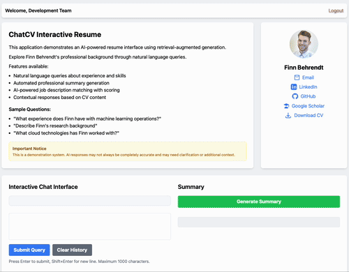

# ChatCV - Your Resume, Now Conversational

Ever wished recruiters could just *ask* your resume questions instead of skimming through bullet points? That's exactly what ChatCV does.

[](./Dockerfile)
[](./LICENSE)

## Demo

<p align="center">
  
</p>

## What it does
ChatCV lets you stand out by turning your resume into a conversation. Instead of hoping recruiters notice the right details, you give them a tool to dig deeper when something catches their interest.

---

## Who's This For?

**Job Seekers & Professionals**
- Stand out from the pile of identical PDFs
- Let interested recruiters explore your background in depth
- Show off your technical skills by adpating (and enhancing) this solution for your CV
- Provide a memorable, interactive experience
- Be available to answer questions 24/7

**Recruiters & Hiring Managers**
- When a candidate catches your interest, dig deeper instantly
- Get specific answers instead of guessing from bullet points
- AI-powered job fit analysis for promising candidates
- **Coming soon**: A tool to compare multiple candidate's CVs for a certain job description

---

## What You Get

**Chat with Resume**: Natural conversation about any aspect of a candidate's background
**Smart Job Matching**: Upload a job description, get detailed fit analysis
**Optional Security**: Deploy publicly or lock it down with invite codes
**Built-in Safety**: Keeps conversations professional and on-topic
**Docker Ready**: Deploy anywhere in minutes


---

**中文说明（推荐）：** 见 [README.zh.md](./README.zh.md)。默认用 venv + uvicorn 运行，不需要 Docker。

## Getting Started

**What you need:**
- Python 3.11+
- An OpenAI-compatible API key when you want chat (DeepSeek etc. via `OPENAI_BASE_URL`). The homepage and `/health` start without a key.

### 1. Get the Code
```bash
git clone https://github.com/lucianwhy/ChatCV.git
cd ChatCV
cp .env.example .env
```

### 2. Add Your Secrets
Edit the `.env` file:
```bash
# Required later for chat (homepage works without it)
OPENAI_API_KEY="your_openai_api_key_here"
# Optional OpenAI-compatible gateway (DeepSeek, etc.)
# OPENAI_BASE_URL="https://api.deepseek.com"
# LLM_MODEL=deepseek-chat

# Optional extras (leave empty if you don't need them)
LANGSMITH_API_KEY="your_langsmith_key"     # For advanced analytics
LANGSMITH_TRACING=false

GUARDRAILS_TOKEN="your_guardrails_token"   # Extra safety (slower build)
```

**Pro tip**: The app works fine without the optional stuff. Only add them if you actually need the features.

### 3. Make It Yours
- Swap out `data/CV_Demo.pdf` with your actual resume
- Edit `data/about_me.md` with extra info not in your CV (or delete it)
- Edit `config/base.yml` if you want to change file paths or naming
- replace `/static/default-avatar.png` with your profile picture

### 4. Start the App (no Docker)
```bash
./scripts/run.sh
```
This creates `.venv`, installs `requirements.txt`, and runs `uvicorn main:app --reload`.

Docker remains optional:
```bash
docker compose up --build
```
### 5. Try It Out
Head to `http://localhost:8000` and start chatting with your resume!

---

## Deploy to the Cloud

The Docker container runs anywhere. Deploy it to your favorite cloud platform - AWS, Azure, GCP, whatever works for you.

**Coming soon**: Step-by-step Azure deployment guide (because that's what I use).

---

## Access Control


**Option 1: Keep it public**
```bash
INVITE_CODES={}
```
Perfect for personal websites or internal demos.

**Option 2: Lock it down**
```bash
INVITE_CODES={
  "RECRUITER1": {"company": "TechCorp", "recruiter": "Jane Smith", "active": true},
  "DEMO2024": {"company": "Demo Access", "recruiter": "Public Demo", "active": true}
}
```
Give specific people access with custom invite codes.

---

## How It Works

**The Stack:**
- FastAPI backend for the API
- Retrieval Augmented Generation (RAG):
  - ChromaDB as Database
  - OpenAI API (or Ollama locally) as LLM
- LangChain connecting the dots
- Guardrails to keep things professional and save

**The Flow:**
1. Your resume gets chopped up and embedded into a vector database
2. When someone asks a question, we find the most relevant parts
3. The LLM writes a natural response using that context (and chat history)
4. Safety filters make sure everything stays professional

Simple, but it works really well.

---

## Want to Contribute?

Got ideas? Found bugs? Want to add features?

Just open an issue or send a PR. I'm always looking to make this better.

**Before you code:** Run `pre-commit install` so the CI doesn't yell at you.

---

## Thanks To

- [LangChain](https://langchain.com/) for LLM magic
- [ChromaDB](https://www.trychroma.com/) for vector search
- [Guardrails AI](https://www.guardrailsai.com/) for keeping it safe

---

**Like this project? Give it a ⭐ - it helps more people find it!**
