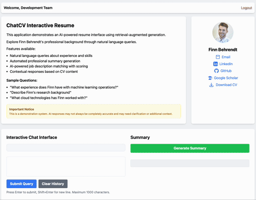
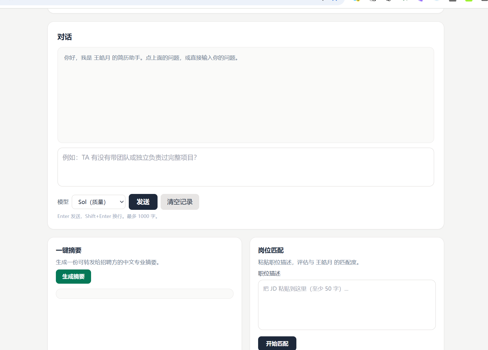

# agentic-me：让你的简历可以对话

把 PDF 简历变成可交互的个人卡片。招聘方可以直接询问你的经历、项目和技能，而不再只能浏览静态条目。

[](./Dockerfile)
[](./LICENSE)

## 演示

<p align="center">
  
</p>

<p align="center">
  
</p>

## 功能

- **简历对话**：自然地回答候选人的经历、项目与技能相关问题。
- **岗位匹配**：上传职位描述，获得与简历的匹配分析。
- **可选访问控制**：可以公开部署，也可用邀请码限制访问。
- **基础安全控制**：让对话保持专业、聚焦。
- **可选 Docker**：默认直接运行，也可用 Docker 部署。

## 适用对象

**求职者与职场人士**

- 从同质化的 PDF 简历中脱颖而出。
- 让感兴趣的招聘方按需深入了解你的背景。
- 在现有方案上定制和扩展，展示技术能力。
- 提供更有记忆点的互动体验，随时响应咨询。

**招聘方与用人经理**

- 对候选人感兴趣时，立即了解更多细节。
- 获得针对性回答，而非从简历条目中猜测。
- 使用 AI 辅助分析候选人与岗位的匹配度。

## 环境要求

- Python 3.11+
- 对话功能需要 OpenAI 兼容的 API Key（可使用 OpenAI、DeepSeek 等）。未配置 Key 时，首页和 `/health` 仍可启动。

## 快速开始

### 1. 获取代码

```bash
git clone https://github.com/lucianwhy/agentic-me.git
cd agentic-me
cp .env.example .env
```

### 2. 配置模型

编辑 `.env`：

```bash
# 对话功能需要配置
OPENAI_API_KEY="your_openai_api_key_here"

# 可选：使用 DeepSeek 等 OpenAI 兼容服务
# OPENAI_BASE_URL="https://api.deepseek.com"
# LLM_MODEL=deepseek-chat

# 可选功能
LANGSMITH_API_KEY="your_langsmith_key"
LANGSMITH_TRACING=false
GUARDRAILS_TOKEN="your_guardrails_token"
```

### 管理页面（/admin）

`/admin` 可在线修改模型设置，需要管理密码。仓库中**没有默认密码**，请只在服务器的 `.env` 中设置：

```bash
ADMIN_PASSWORD=change-me   # 换成你自己的强密码，切勿提交到仓库
```

未设置 `ADMIN_PASSWORD` 时，管理登录与设置接口会被禁用（返回 503 和中文提示）。

### 3. 换成你的资料

- 用自己的简历替换 `data/CV_Demo.pdf`。
- 编辑 `data/about_me.md`，补充简历中没有的信息；不需要时可以删除。
- 可选：在 `data/tools/` 放工具介绍（Markdown + front matter：`id` / `title` / `aliases`），会按 `##` 章节切块入库，`id` 与 `frontend/src/data/tools.ts` 对应；不会通过 `/data` 对外提供。
- 在 `config/base.yml` 中修改候选人信息、文件路径和名称。
- 用你的头像替换 `static/default-avatar.png`。

### 4. 启动服务

默认方式无需 Docker：

```bash
./scripts/run.sh
```

该脚本会创建 `.venv`、安装 `requirements.txt` 并运行 `uvicorn main:app --reload`。随后访问 `http://localhost:8000`。

Docker 是可选方式：

```bash
docker compose up --build
```

## 前端（React + shadcn/ui）

对话页位于 `frontend/`（Vite + React + TypeScript + Tailwind CSS + shadcn/ui）。构建产物 `frontend/dist/` **会提交到仓库**，FastAPI 直接在 `/` 提供它，因此服务器部署只需 `git pull`，无需 Node。若 `frontend/dist/` 不存在，`/` 会回退到旧的 `templates/chat.html`。

需要 Node 22.18+（构建脚本直接运行 TypeScript）：

```bash
cd frontend
npm install
npm run dev       # http://localhost:5173 ，热更新；API 请求代理到 uvicorn :8000
npm run build     # 检查架构图是否最新 + tsc + 输出到 frontend/dist（改完前端后提交 dist）
npm run diagrams  # 修改 src/data/diagram-sources.ts 后运行：用本机 Chrome 预渲染 Mermaid 架构图
```

「我的项目」页的架构图在构建时预渲染为静态 SVG（`src/generated/diagrams.ts`，需提交），因此 dist 中不包含 mermaid。`npm run diagrams` 需要本机 Chrome/Chromium（找不到时设置 `CHROME_PATH`）；源文件改了却没重新生成时，`npm run build` 会直接报错提示。

开发时先启动后端（`uvicorn main:app --reload --port 8000`），再运行 `npm run dev`。如需代理到其他地址，可设置 `VITE_BACKEND_URL`。候选人信息通过只读接口 `GET /api/profile` 提供，来源仍是 `config/base.yml`。

## 建立向量库

配置好 API Key 并替换简历后，运行：

```bash
source .venv/bin/activate
./scripts/ingest.sh
# 或：python -m app.modules.rag_pipeline --ingest
```

服务在已有 API Key、但没有向量库时也会尝试自动入库；若失败会返回明确的中文 503 错误。

## 访问控制

保持以下配置即可公开访问：

```bash
INVITE_CODES={}
```

只允许特定招聘方访问时，可设置邀请码：

```bash
INVITE_CODES={"ACME": {"company": "某公司", "recruiter": "张三", "active": true}}
```

## 常用接口

| 方法 | 路径 | 说明 |
| --- | --- | --- |
| GET | `/` | 个人卡片与对话页面（React 构建产物；缺失时回退 Jinja 模板） |
| GET | `/api/profile` | 前端使用的公开候选人信息（只读，无密钥） |
| GET | `/health` | 健康检查，并返回 `llm_configured`、`vectorstore_ready` |
| POST | `/chat` | RAG 对话 |
| POST | `/chat/stream` | RAG 对话（SSE 流式） |
| GET | `/models` | 可选模型及默认模型 |
| POST | `/summary` | 生成中文摘要 |
| POST | `/job-match` | 岗位匹配分析 |
| POST | `/api/retrieve` | 检索演示：返回 Top-K 片段与余弦相似度（不调用 LLM，按 `rate_limit` 限流） |
| GET | `/auth/status` | 公开模式下返回 `auth_enabled: false` |

开发环境还提供 `/docs`。

## 部署

Docker 容器可部署到任意支持 Docker 的平台。非 Docker 部署时，使用 Python 虚拟环境安装依赖，并在生产环境去掉 `--reload` 即可。

## 贡献

欢迎提交 Issue 或 Pull Request。开始开发前请运行 `pre-commit install`，以避免 CI 检查失败。

## 致谢

- [LangChain](https://langchain.com/)
- [ChromaDB](https://www.trychroma.com/)
- [Guardrails AI](https://www.guardrailsai.com/)

如果这个项目对你有帮助，欢迎点一个 Star。
